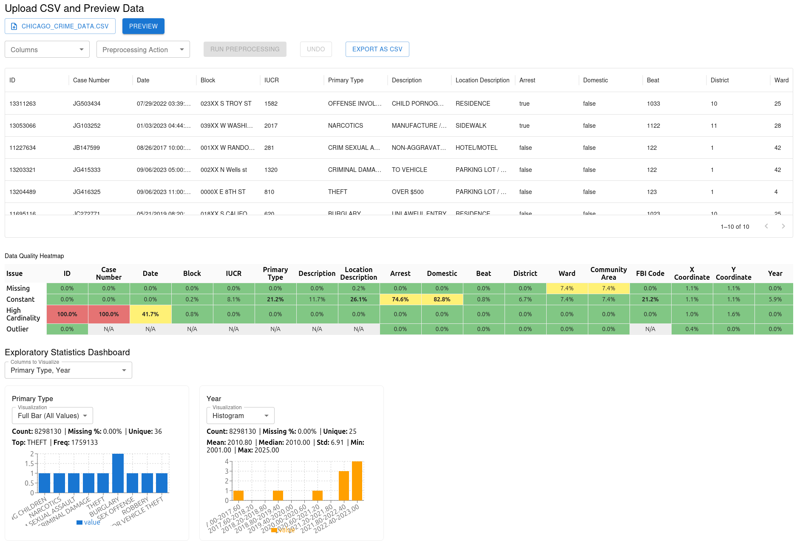

# DataPrepper

An interactive dashboard for data preprocessing, visualization, and exploratory analysis. Built with a Python FastAPI backend and a React frontend, this tool streamlines the process of cleaning, exploring, and preparing data for machine learning workflows.

## Demo



<video src="docs/screencast.webm" controls width="600">Your browser does not support the video tag.</video>

*Above: Screenshot and demo video of DataPrepper in action.*

## Features

- **CSV Upload & Preview:** Upload CSV files and preview your data instantly.
- **Exploratory Data Analysis:** Visualize column statistics, distributions, and missingness.
- **Data Preprocessing:**
  - Impute missing values
  - Encode categorical variables
  - Scale numeric features
  - Drop columns
- **Undo/Redo:** Easily revert preprocessing steps.
- **Export:** Download the processed data as a CSV file.
- **Interactive Visualizations:** Resizable, responsive charts for both numeric and categorical data.

## Tech Stack

- **Backend:** Python, FastAPI
- **Frontend:** React, TypeScript, Material-UI, Recharts

## Project Structure

```
preprocessor/
├── backend/           # FastAPI backend
│   ├── app/           # Application code
│   ├── requirements.txt
│   └── start.sh
├── frontend/          # React frontend
│   ├── src/           # React source code
│   ├── public/
│   └── package.json
├── .gitignore
├── README.md
└── ...
```

## Getting Started

### Prerequisites
- Python 3.8+
- Node.js 16+

### Backend Setup
```bash
cd backend
python3 -m venv venv
source venv/bin/activate
pip install -r requirements.txt
./start.sh
```

### Frontend Setup
```bash
cd frontend
npm install
npm start
```

The frontend will be available at `http://localhost:3000` and the backend API at `http://127.0.0.1:8000`.

## Usage
1. Upload a CSV file via the dashboard.
2. Explore data statistics and visualizations.
3. Apply preprocessing steps as needed.
4. Export the cleaned data for downstream tasks.

## Contributing
Pull requests are welcome! For major changes, please open an issue first to discuss what you would like to change.

## License
[MIT](LICENSE)

## Acknowledgments
- [FastAPI](https://fastapi.tiangolo.com/)
- [React](https://react.dev/)
- [Material-UI](https://mui.com/)
- [Recharts](https://recharts.org/)
